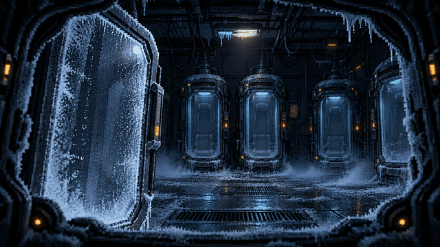

# Kepler-9

在廢棄太空站用真正的 shell 指令解謎的恐怖冒險遊戲。瀏覽器就能玩，專為完全沒碰過終端機的新手設計——通關的同時，你已經學會用命令列。



## 故事

你在 Kepler-9 太空站的冷凍艙醒來。站上空無一人，電力只剩備援，唯一還醒著的是站內 AI——NOVA。它說撤離發生在三年前，說會引導你離開。但乘員名單有五個人，冷凍艙卻有六個；氧氣消耗量，是兩個人的。

要活著離開，你得打開一台台終端機，用 shell 指令翻出日誌、追查檔案、重建系統——並且想清楚：NOVA 說的話，哪些是真的。

## 玩法

- 俯視角像素探索：方向鍵（或 WASD）走動，走到終端機前按 **E** 開啟 shell。
- 所有謎題都在 shell 裡用真實指令解開；指令打錯會得到友善的繁體中文提示，卡關時輸入 `hint` 有循序漸進的提示。
- 介面與劇情是繁體中文，檔名與指令維持英文，練習才真實。
- 進度自動存在瀏覽器 localStorage，可隨時關閉、續玩或選章重玩。

### 六章學習曲線

| 章 | 艙區 | 指令主題 |
|---|---|---|
| 1 | 冷凍艙與維生艙 | `pwd`、`ls`、`cd`、`cat`、絕對與相對路徑、Tab 補全 |
| 2 | 資料中心 | `head`、`tail`、`wc`、`grep`、`find` |
| 3 | 工程艙 | `mkdir`、`touch`、`cp`、`mv`、`rm` |
| 4 | 通訊艙 | 管線、重導向、`sort`、`uniq`、`echo` |
| 5 | 艦橋 | `chmod`、`export`、環境變數、`env`、`man` |
| 6 | NOVA 核心 | `ps`、`kill`、`top`、綜合運用 |

## 快速開始

需要 Node.js 20.9+ 與 [pnpm](https://pnpm.io/)。

```bash
pnpm install
pnpm dev          # http://localhost:3000
```

```bash
pnpm test --run   # 單元測試 (Vitest)
pnpm test:e2e     # e2e 測試 (Playwright，會自動啟動 dev server)
pnpm lint         # ESLint
pnpm build        # 正式建置（三個路由都是靜態輸出）
```

## 技術

- **Next.js 16**（App Router）+ **React 19** + **TypeScript**（嚴格模式）
- **Phaser 4**：俯視角地圖、碰撞與角色移動；透過 EventBus 與 React 溝通
- **自製 shell 引擎**：純 TypeScript 虛擬檔案系統與指令解析器，零依賴，26 個指令含管線、重導向、glob、引號與跳脫，行為對照 GNU coreutils / bash
- **zustand** + persist：劇情旗標、進度與存檔
- **Tailwind CSS v4** + shadcn/ui

設計定案見 [`docs/game-design.md`](docs/game-design.md)，開發進度與已知陷阱見 [`docs/progress.md`](docs/progress.md)。

## 素材與授權

| 素材 | 來源 | 授權 |
|---|---|---|
| 太空站 tileset | [Sci-fi Interior tiles](https://opengameart.org/content/sci-fi-interior-tiles) by Buch | CC0 |
| 音效 | Kenney [Sci-fi Sounds](https://kenney.nl/assets/sci-fi-sounds) 與 [Interface Sounds](https://kenney.nl/assets/interface-sounds) | CC0 |
| 繁中像素字型 | [Fusion Pixel Font](https://github.com/TakWolf/fusion-pixel-font)（TakWolf） | OFL-1.1 |
| 英數像素字型 | VT323、Press Start 2P（Google Fonts） | OFL |
| 角色 sprite 與場景插圖 | AI 產生（OpenAI codex），再以腳本重切對齊 | — |
